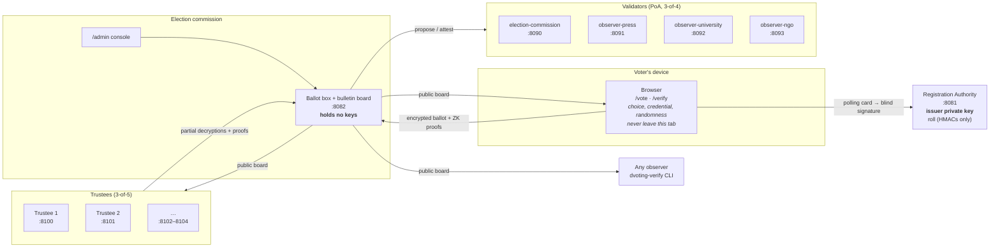
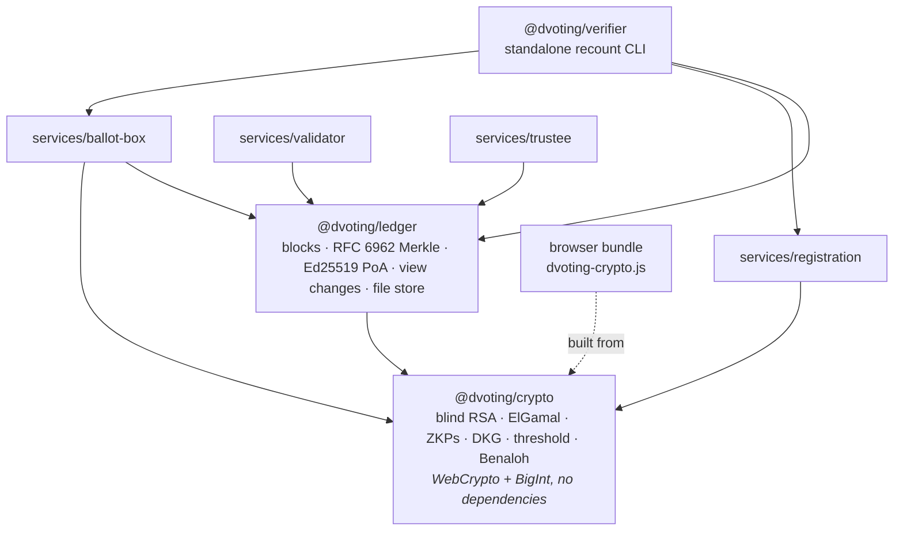
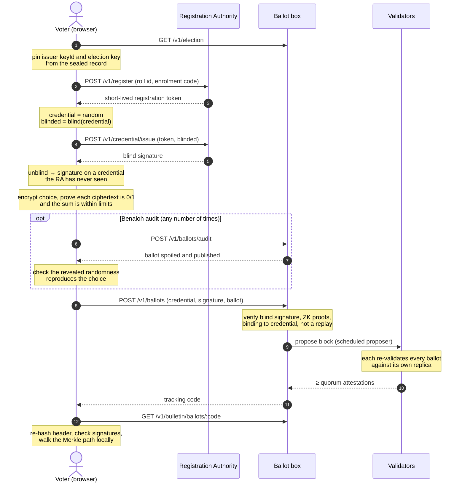
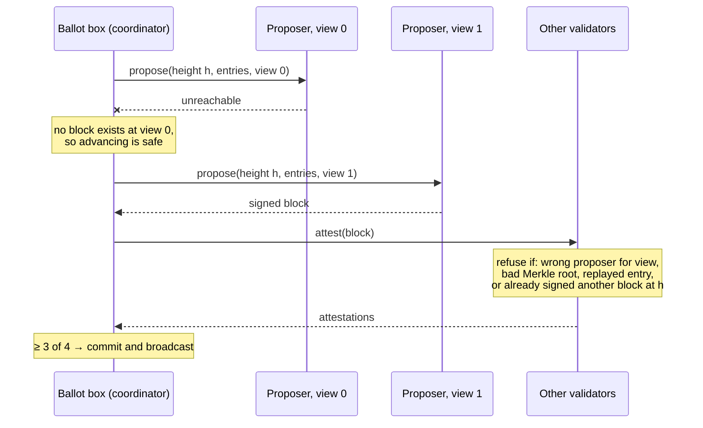
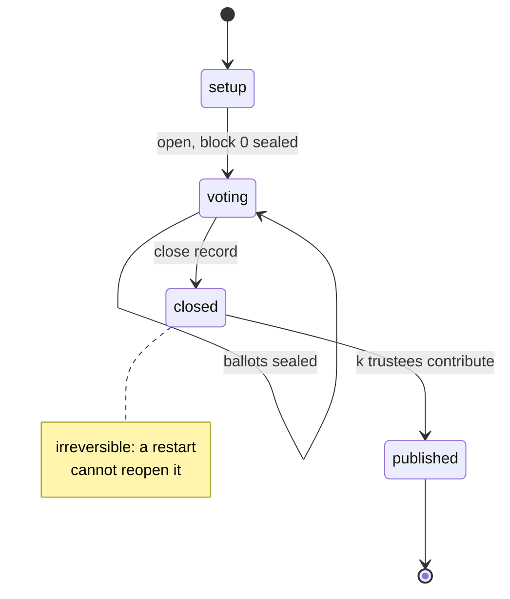
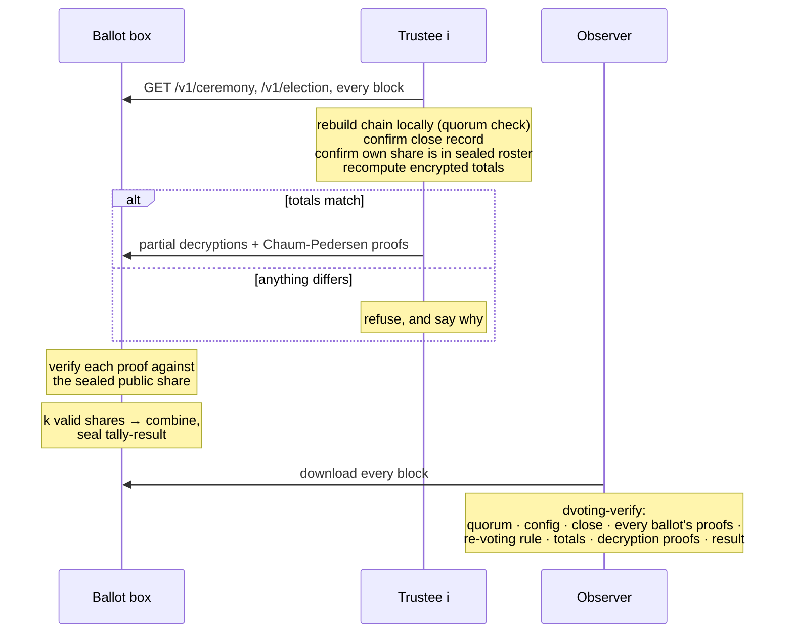
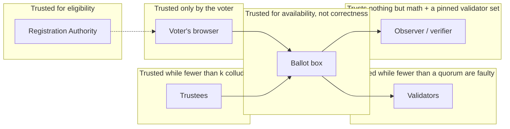

# Architecture

How the parts of D-Voting fit together, who holds which key, and where the trust
boundaries are. The diagrams are Mermaid and render on GitHub. For why each
decision was made, see the subsystem notes linked from the [README](../README.md);
for what each part defends against, see the [threat model](threat-model.md).

---

## 1. Components and who holds what

Each box is a separate process. In a real deployment each one is a separate
organisation on separate hardware. `npm run dev` runs them all on one machine,
on the ports shown.

| Party | Holds | Can do alone | Cannot do |
|---|---|---|---|
| Voter's browser | choice, credential, blinding factor, randomness | build and audit its own ballot | — |
| Registration Authority | issuer private key, roll HMACs, pepper | issue one credential per roll entry | see the credential it signed |
| Ballot box | nothing secret | accept, reject, queue ballots; serve the board | sign a block, decrypt anything |
| Validator | one Ed25519 key, own chain replica | refuse a bad block | produce a block alone |
| Trustee | one Shamir key share | refuse to decrypt | decrypt alone |
| Observer | the public board, optionally a pinned validator set | recount everything | — |

---

## 2. Packages

The browser runs the **same** `@dvoting/crypto` source as the server and the
tests, bundled unminified by `npm run build:web`.

---

## 3. Casting a ballot

---

## 4. Sealing a block, with failover

Two rules make failover fork-free: any two quorums of more than 2/3 overlap, and
no validator signs two different blocks at one height. See
[ledger notes](ledger-and-bulletin-board.md).

---

## 5. The election's life on the chain

| Entry kind | Written when | Contains |
|---|---|---|
| `election-config` | open (block 0) | the whole sealed definition |
| `ballot` | each cast | encrypted choices, proofs, credential fingerprint |
| `spoiled-ballot` | each audit | the ballot and its revealed randomness |
| `election-closed` | close | reason, time, final height |
| `tally-result` | last trustee share | totals, every partial decryption and proof, results |

---

## 6. Counting

---

## 7. Trust boundaries

The ballot box sits in the least-trusted position on purpose. It can refuse
service, which is visible. It cannot change the outcome undetectably, because
every output it produces is checked by someone who does not trust it.

---

## 8. Storage

| Data | Where | Durability |
|---|---|---|
| Chain | Validator and ballot-box replicas; `CHAIN_PATH` file store (append-only, fsync) | Survives restarts; any replica or observer copy is enough to recount |
| Roll, issuance records, audit log | RA: Postgres (production) or memory (dev) | Postgres with `REVOKE UPDATE, DELETE` on the audit log |
| Keys | Each party's own environment | Not in any database |
| Exported board | `dvoting-verify --save board.json` | Verifiable offline indefinitely |
